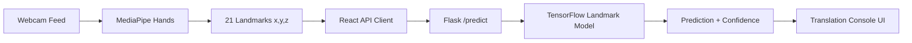

# Real-Time Sign Language Translator

An AI-powered web application that translates ASL hand signs into text in real time using MediaPipe hand landmarks and a TensorFlow classifier.

## Highlights

- Real-time webcam inference with MediaPipe hand landmark tracking
- Landmark-based TensorFlow model (`63` features per frame: `21` points × `x,y,z`)
- React frontend with live camera visualization and translation console
- Flask backend API serving predictions and confidence scores

## Tech Stack

- **Frontend:** React, Axios, MediaPipe Hands
- **Backend:** Flask, TensorFlow, NumPy
- **ML/Data:** MediaPipe Hand Landmarker, scikit-learn

## Architecture



## Repository Structure

```text
.
├─ frontend/
│  ├─ src/
│  │  ├─ components/HandTracking.js
│  │  ├─ services/api.js
│  │  ├─ App.js
│  │  └─ App.css
│  └─ package.json
├─ sign-language-alphabet/
│  ├─ app.py
│  ├─ extract_landmarks.py
│  ├─ train_landmark_model.py
│  ├─ requirements.txt
│  ├─ requirements-prod.txt
│  └─ Dockerfile
└─ README.md
```

## Local Setup

### 1) Backend

```bash
cd sign-language-alphabet
python -m venv env
env\Scripts\activate
pip install -r requirements.txt
python app.py
```

Backend runs on `http://127.0.0.1:5000`.

### 2) Frontend

```bash
cd frontend
npm install
npm start
```

Frontend runs on `http://localhost:3000`.

## Render Deployment (Backend)

To reduce cold-start overhead on Render free instances, use the slim runtime dependency file:

- **Root Directory:** `sign-language-alphabet`
- **Build Command:** `pip install -r requirements-prod.txt`
- **Start Command:** `gunicorn app:app --bind 0.0.0.0:$PORT --timeout 120 --workers 1 --threads 2`
- **Health Check Path:** `/`

Use `requirements.txt` for local training/development and `requirements-prod.txt` for Render runtime.

## Model Training

Training scripts are included in `sign-language-alphabet/extract_landmarks.py` and
`sign-language-alphabet/train_landmark_model.py`.

## API

### `POST /predict`

Request body:

```json
{
  "keypoints": [0.12, 0.34, -0.02, "... total 63 values ..."]
}
```

Response:

```json
{
  "prediction": "A",
  "confidence": 0.98
}
```

## Author

- Khalifeh Basiri  
- Website: [https://kbasiri.com](https://kbasiri.com)
